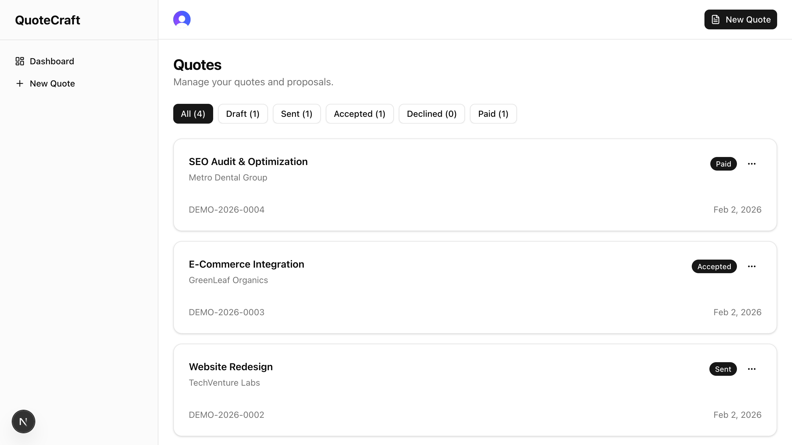

# QuoteCraft

[](https://github.com/ryancalacsan/quotecraft/actions/workflows/ci.yml)
[](https://codecov.io/gh/ryancalacsan/quotecraft)

A modern quote builder for freelancers and contractors. Create professional quotes, share them with clients via unique links, accept payments through Stripe, and track everything from a clean dashboard.

Built as a portfolio project demonstrating full-stack skills: complex form state, real-time pricing with Decimal.js, Stripe Checkout, Clerk auth, testing, and CI/CD.

**[Try the Live Demo](https://quotecraft.vercel.app)** — no signup required, explore instantly



## Features

- **Quote Builder** — Create quotes with multiple line items, pricing types (fixed, hourly, per-unit), discounts, and deposit percentages
- **Real-Time Pricing** — Live subtotal, deposit, and total calculations powered by Decimal.js (no floating-point errors)
- **Shareable Links** — Each quote gets a unique public URL for client review
- **Client Actions** — Clients can accept, decline, or pay quotes directly from the public link
- **Stripe Payments** — Secure checkout for deposits or full amounts via Stripe Checkout
- **Quote Lifecycle** — Draft, Sent, Accepted, Declined, Paid statuses with locking on send
- **Demo Mode** — Explore the full app instantly with pre-seeded data (Clerk Sign-In Tokens)
- **Responsive Design** — Desktop sidebar + mobile slide-out nav, stacked layouts for small screens
- **Dashboard** — Filter quotes by status, duplicate, delete, and manage from one place

## Tech Stack

| Layer        | Technology               |
| ------------ | ------------------------ |
| Framework    | Next.js 16 (App Router)  |
| Language     | TypeScript (strict)      |
| Styling      | Tailwind CSS + shadcn/ui |
| Database     | Supabase (PostgreSQL)    |
| ORM          | Drizzle ORM              |
| Auth         | Clerk                    |
| Payments     | Stripe Checkout          |
| Pricing Math | Decimal.js               |
| Validation   | Zod                      |
| Unit Tests   | Vitest                   |
| E2E Tests    | Playwright               |
| CI/CD        | GitHub Actions           |
| Deployment   | Vercel                   |

## Getting Started

### Prerequisites

- Node.js 20+
- pnpm 9+
- A Supabase project (free tier)
- A Clerk application (free tier)
- A Stripe account (test mode)

### Installation

```bash
git clone https://github.com/ryancalacsan/quotecraft.git
cd quotecraft
pnpm install
```

### Environment Variables

Copy the example file and fill in your keys:

```bash
cp .env.local.example .env.local
```

Required variables:

| Variable                             | Source                          |
| ------------------------------------ | ------------------------------- |
| `DATABASE_URL`                       | Supabase → Settings → Database  |
| `NEXT_PUBLIC_CLERK_PUBLISHABLE_KEY`  | Clerk Dashboard                 |
| `CLERK_SECRET_KEY`                   | Clerk Dashboard                 |
| `STRIPE_SECRET_KEY`                  | Stripe Dashboard                |
| `NEXT_PUBLIC_STRIPE_PUBLISHABLE_KEY` | Stripe Dashboard                |
| `STRIPE_WEBHOOK_SECRET`              | Stripe CLI or Dashboard         |
| `NEXT_PUBLIC_APP_URL`                | `http://localhost:3000` for dev |

### Database Setup

```bash
pnpm drizzle-kit push
```

Then apply the `updatedAt` trigger in your Supabase SQL editor (see `lib/db/schema.ts` for the SQL).

### Development

```bash
pnpm dev
```

Open [http://localhost:3000](http://localhost:3000).

For Stripe webhooks in development:

```bash
stripe listen --forward-to localhost:3000/api/webhooks/stripe
```

### Testing

```bash
# Unit tests
pnpm test

# Unit tests in watch mode
pnpm test:watch

# E2E tests (requires dev server)
pnpm test:e2e
```

## Project Structure

```
quotecraft/
├── proxy.ts                         # Clerk auth middleware (Next.js 16)
├── app/
│   ├── (auth)/                      # Sign-in / sign-up pages
│   ├── (dashboard)/                 # Protected: dashboard, quote CRUD
│   ├── q/[shareToken]/              # Public quote view + payment
│   ├── api/
│   │   ├── webhooks/{clerk,stripe}/ # Webhook handlers
│   │   ├── checkout/                # Stripe session creation
│   │   ├── cron/reset-demo/         # Nightly demo data reset
│   │   └── demo/login/              # Demo sign-in token
│   └── actions/                     # Server Actions (quotes, line items)
├── components/
│   ├── ui/                          # shadcn/ui primitives
│   ├── quote-builder/               # Quote form, line items, pricing
│   ├── dashboard/                   # Quote list, cards, mobile nav
│   └── shared/                      # Demo banner, demo login button
├── lib/
│   ├── db/                          # Drizzle client, schema, queries
│   ├── validations/                 # Zod schemas
│   ├── pricing.ts                   # Decimal.js calculations
│   ├── stripe.ts                    # Stripe client
│   └── utils.ts                     # Formatting helpers
└── tests/
    ├── unit/                        # Vitest (pricing, utils, validations)
    └── e2e/                         # Playwright (smoke tests)
```

## Note

This is a portfolio demo project. User registration is disabled — click "Try Demo" to explore the full application with pre-seeded sample data. Data resets nightly.

## License

MIT
# test
